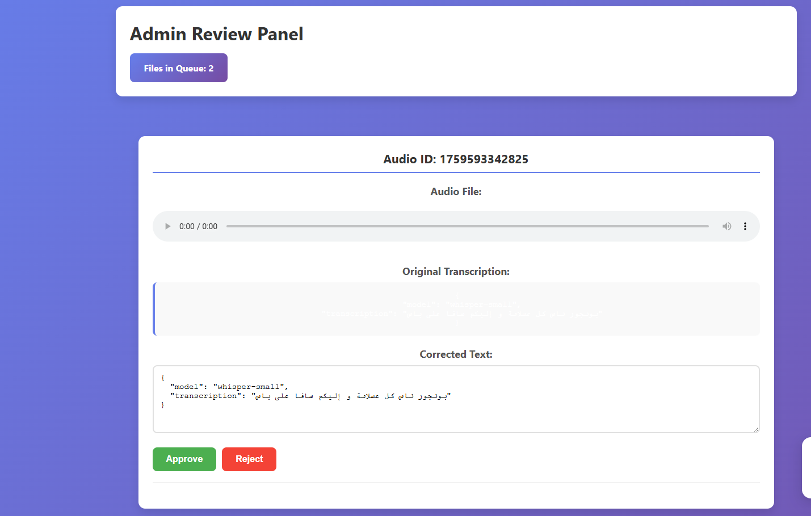

# 🗣️ Tunisian-Voice-Pipeline

A **public speech-to-text API** designed for the **Tunisian Arabic dialect**, aggregating results from multiple ASR models and providing a correction dashboard for data collection and fine-tuning. This project is fully containerized and cloud-ready.

---

## 🎯 Project Objectives

1. Provide a **REST API** that accepts audio and returns aggregated transcriptions from multiple models:
   - Whisper Small
   - Whisper Medium
   - Wav2Vec2 (other models possible)
2. Collect user data (audio + corrected text) for **fine-tuning** Tunisian ASR models.
3. Deploy in **Kubernetes (Kind for local testing, AKS for production)**.
4. Use **OpenResty (Nginx + Lua)** as a reverse proxy for request routing and aggregation.
5. Provide a **dashboard** for admins to validate/correct transcriptions.
6. Use **Azure Blob Storage and Queue** for event-driven processing.

---

## 🧱 Architecture Overview

  
*Swagger interface of the public API.*

  
*Dashboard screenshot for admin transcription review.*

### Components

| Component | Tech | Description |
|-----------|------|-------------|
| **Aggregation API** | Python (Flask) | Aggregates outputs from multiple ASR models and returns best transcription |
| **Reverse Proxy** | OpenResty (Nginx + Lua) | Handles routing, ID assignment, and authentication |
| **Queue & Blob** | Azure Storage | Manages messages for event-driven transcription collection and storage |
| **Dashboard** | HTML/CSS/JS | Admin review and correction interface |
| **Infrastructure** | Terraform + AKS / Kind | Cloud and local deployment manifests |
| **Models (Docker)** | Whisper Small, Whisper Medium, Wav2Vec2 | Dockerized ASR models |

---

## 🌐 DockerHub Images

- Whisper Small → [ghaythbz/whisper-jdide](https://hub.docker.com/repository/docker/ghaythbz/whisper-jdide/general)  
- Whisper Medium → [ghaythbz/whisper-medium-api](https://hub.docker.com/repository/docker/ghaythbz/whisper-medium-api/general)  
- Aggregation API → [ghaythbz/agg-api](https://hub.docker.com/repository/docker/ghaythbz/agg-api/general)

> Note: Models are **not stored in GitHub**. Pull images from DockerHub for local or cloud deployment.

---

🧠 Future Work

Expand to more Tunisian dialect ASR models

Fine-tune Whisper/Wav2Vec on collected data

Add automated model selection and confidence scoring

Improve admin dashboard UX

👤 Author

Ghayth Bouzayani